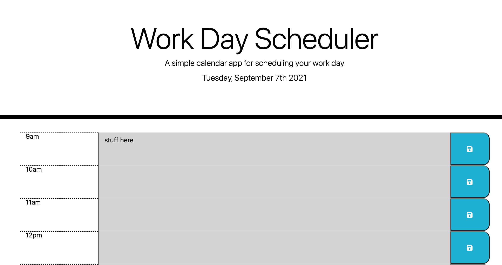

# super-disco

#### This is a site made by HTML, CSS, JavaScript, Bootstrap, Moment, and jQuery 

#### Ellyse Carter

## Description

## Setup/Installation Requirements
Open terminal or a similar app on your computer and change directory to Desktop. Copy https://github.com/ellysecarter/codingguru.git.  Use git clone and paste that link after it to clone the repository.  Open the folder it provides. Open the HTML folder inside. You can also go to this link to see the full site https://ellysecarter.github.io/codingguru/

## Known Bugs
 

## Contact Details
email: ellysecarter@yahoo.com

Technologies Used
HTML CSS JavaScript

